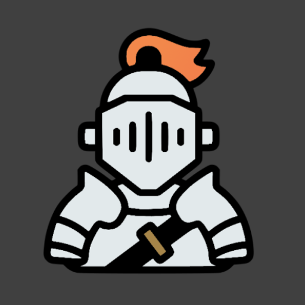

# OpenRol

OpenRol es una aplicación de software libre y código abierto para los amantes de los juegos de rol que quieran un poco de ayuda extra con la gestión 
de sus partidas.

La fase actual de desarrollo contiene lo fundamental para jugar con guardado de personajes a la quinta edición de Dungeons&Dragons (la más jugada en el mundo).
Las aportaciones para implementar otros sistemas de juego son bienvenidas, aunque que por el momento la idea es añadir Aquelarre y Canción de Hielo y Fuego. 

OpenRol cuenta con un apartado de dados para realizar tiradas varias, con modificadores y opciones, así como una pantalla de personaje desde la que se
puede tirar en cada habilidad con sus respectivas modificaciones.

